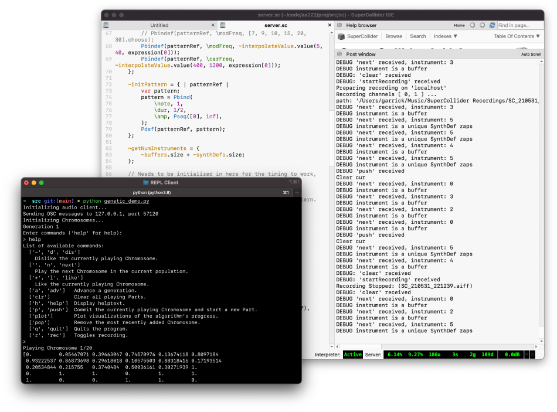
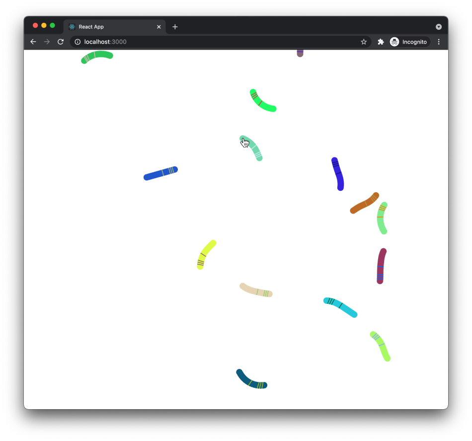

# genalg-sequencer: Genetic Algorithms for Interactive Music Creation

This is a repo containing work for two separate projects for the classes
AA222/CS361: Engineering Design Optimization and MUSIC 220A: Fundamentals of
Computer-Generated Sound. The second project can be thought of as an extension
to the other, utilizing the genetic algorithm utilities developed as the backend
for an audiovisual experience and interface where you can play with the music
evolutionary process itself.

Check out some demos (produced for AA222/CS361)
[here](https://garrickf.github.io/genalg-sequencer/)!

The paper for AA222/CS361, "Genetic Algorithms for Interactive Music Creation,"
can be found
[here](https://raw.githubusercontent.com/garrickf/genalg-sequencer/main/tex/paper.pdf).

The writeup for MUSIC 220A (WIP) can be found on CCRMA
[here](https://ccrma.stanford.edu/~gfaerr/220a/final/).

# Installing dependencies

This project uses Node to run the React web application, Python (with Anaconda
to manage dependencies), and SuperCollider/ChucK to handle audio synthesis.

If you want to reproduce the work, it's advised to get Anaconda (conda) to
install the exact same dependencies I used whilst developing this project. With
conda installed, from the base directory of this project, you can run:

```zsh
conda env create -f environment.yml
```

This will create a conda environment with the prefix `gen_music`. Now you can
activate the environment:

```zsh
conda activate gen_music
```

# Starting REPL Client

> _The REPL client program and SuperCollider audio server code were done for my
> final project in AA222/CS361: Engineering Design Optimization._



The REPL Client is a simple terminal-based client that allows a user to provide
feedback to the music genetic algorithm, monitor and manipulate its progress,
and listen to and record the resulting sound.

Unfortunately, I haven't yet produced a script for the SuperCollider server.
You'll need to run it inside the SuperCollider IDE, which requires some minimal
knowledge to get started. I hope in the future to be able to initialize the
server simply by invoking the `scsynth` and `sclang` executables.

To start the client, you'll first need to make sure the SuperCollider server
`sc/server.sc` is running. Then, navigate to the `src` directory and run:

```zsh
python genetic_demo.py
```

In the client, you can type the command "help" (or "h" for short) to see a list
of the available commands. A reproduction follows:

```plaintext
['-', 'd', 'dis']  Dislike the currently playing Chromosome.
['', 'n', 'next']  Play the next Chromosome in the current population.
['+', 'l', 'like'] Like the currently playing Chromosome.
['a', 'adv']       Advance a generation.
['clr']            Clear all playing Parts.
['h', 'help']      Display helptext.
['p', 'push']      Commit the currently playing Chromosome and start a new Part.
['plot']           Plot visualizations of the algorithm's progress.
['pop']            Remove the most recently added Chromosome.
['q', 'quit']      Quits the program.
['r', 'rec']       Toggles recording.
```

# 🐛 Starting Audiovisual Client (Wormfood)

> _The audiovisual client program and ChucK code were done for my final project
> in MUSIC 220a._



To start the web client, navigate to the `src/client` directory. From there, you
can run:

```zsh
npm start
```

The web client sends requests via loopback to the port specified in `api.js` and
`app.py`. You can boot the Flask web server by navigating to the the `src`
directory and running:

```zsh
flask run
```

The Flask server sends messages using the Open Sound Control (OSC) standard to
an audio server, which produces the audio. To start a (demo) ChucK server,
navigate to the `src/chuck` directory. From there, you can run:

```zsh
chuck r.ck
```

# Testing

To run tests, navigate to the `src` directory and run:

```zsh
python -m pytest
```

## Known Issues

This is a prototype/school project and not meant for production. There are a few
problems and features, cut for time, I'd like to return to someday:

- Expression information is ingested but not yet interpolated in the
  SuperCollider client, causing instruments to sound the same. 🥲
- The `pop` command in the REPL is non-functional.
- Plotting in the REPL is a little arbitrary, and some planned plots were left
  unimplemented, cut for time.
- Weighting exists but is non-functional.
